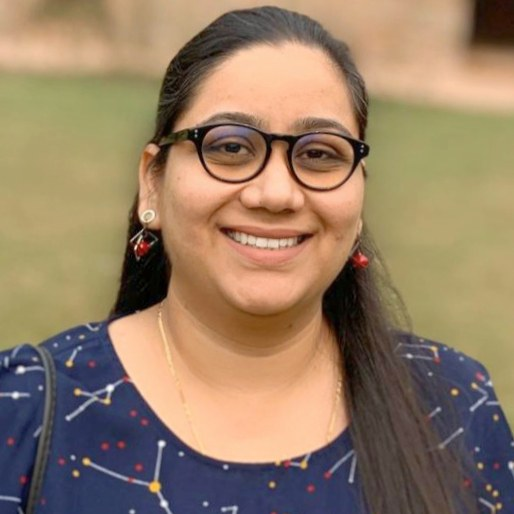

:::: {.profile}
{.headshot fig-alt="Portrait of Dr. Richa Singh"}

Hi, I'm Richa.

I'm an educator and researcher in biotechnology at SIES College of Arts, Science
& Commerce in Mumbai. Classrooms and labs have been my happy place for close to a
decade now, whether I'm explaining a concept, designing an experiment, or watching
a student present their first research finding.

My research grew out of a simple fascination: can tiny living things help us build
tiny powerful things? That question led me to my doctoral work in
bionanotechnology. I began by coaxing bacteria like *Acinetobacter* into making
silver, gold and selenium nanoparticles, and the work has since grown into
antimicrobial and anticancer applications, pulling dyes out of wastewater with
agricultural waste, and designing adsorbents that can capture microplastics.

If you ask what I'm proudest of, though, it's the students: the postgraduate
dissertations I've guided, the undergraduates I've walked through their first
projects, and the NPTEL mentees I've cheered on, several of whom finished as
national toppers. I teach across nanotechnology, immunology, cytogenetics,
biostatistics and research methodology, and I genuinely enjoy making these
subjects feel less intimidating and more exciting than their names suggest.

I'm always happy to connect, whether you're a student looking for guidance, a
researcher exploring a collaboration, or simply someone curious about the nano
world.

::: {.tags}
[Bionanotechnology]{.tag} [Environmental biotechnology]{.tag} [Microbiology]{.tag} [Antimicrobial resistance]{.tag} [Dye biosorption]{.tag} [Science education]{.tag}
:::

::: {.linkrow}
[ORCID](https://orcid.org/0000-0001-7184-9958) [Email](mailto:richas@sies.edu.in) [Download CV (PDF)](cv/richa-singh-cv.pdf)
:::

<!-- TODO: add her Google Scholar profile once we have the URL. It belongs in
     the row above, first, because it is the link most visitors will want:
       [Google Scholar](https://scholar.google.com/citations?user=XXXXXXXX)
     Left out for now rather than shipping a link that goes nowhere. -->

::::

## Research

My work runs across three connected threads:

<!-- Each thread is a one-sentence summary of a section on the Research page.
     If research.qmd's overview changes, change these too — they are the only
     place on the site where the same claim is made twice. -->
:::: {.threads}
::: {.thread}
[Bacteria-made nanomaterials]{.tt}
[Using *Acinetobacter* and other environmental isolates to synthesise silver, gold and selenium nanoparticles, tested against drug-resistant bacteria, biofilms, tuberculosis and cancer cell lines.]{.td}
:::

::: {.thread}
[Cleaning up water]{.tt}
[Biosorbents made from agricultural waste that strip textile dyes out of water, and nanomaterials that may capture microplastics.]{.td}
:::

::: {.thread}
[Science education]{.tt}
[How online professional courses, MOOCs and blended classrooms change teaching practice and learning outcomes in undergraduate science.]{.td}
:::
::::

<!-- Metrics are a snapshot, not a live feed. Worth refreshing once a year from
     her Google Scholar profile, and updating the date below when you do.
     TODO: once we have her Scholar URL, make "Google Scholar" in the note a link. -->
:::: {.stats}
::: {.stat}
[28]{.n}
[publications (25 journal articles, 3 book chapters)]{.l}
:::

::: {.stat}
[3,000+]{.n}
[citations]{.l}
:::

::: {.stat}
[19]{.n}
[h-index]{.l}
:::

::: {.stat}
[19]{.n}
[i10-index]{.l}
:::

::: {.stat}
[10]{.n}
[research students guided (3 PG, 7 UG)]{.l}
:::
::::

[Figures as of August 2026. Citation metrics from Google Scholar.]{.fignote}

:::: {.cols}
::: {.col}
## Appointments

::: {.entry}
[2018 – present]{.yr}
[Assistant Professor]{.ti}
[Department of Biotechnology, SIES College of Arts, Science & Commerce (Autonomous), Sion (W), Mumbai]{.de}
:::

::: {.entry}
[2017 – 2018]{.yr}
[Lecturer]{.ti}
[SIES College, Sion (W), Mumbai]{.de}
:::

::: {.entry}
[2016 – 2017]{.yr}
[Assistant Professor]{.ti}
[Institute of Science, Fort, Mumbai]{.de}
:::

::: {.entry}
[Ongoing]{.yr}
[Visiting Faculty]{.ti}
[Departments of Biotechnology and Biophysics, University of Mumbai; Centre of Excellence in Basic Sciences (UM-DAE-CEBS), Mumbai]{.de}
:::
:::

::: {.col}
## Education

::: {.entry}
[2017]{.yr}
[Ph.D. Biotechnology]{.ti}
[Savitribai Phule Pune University · Thesis: *Acinetobacter* sp. mediated synthesis of metal nanoparticles and their applications in biotechnology]{.de}
:::

::: {.entry}
[2010]{.yr}
[M.Sc. Biotechnology]{.ti}
[University of Mumbai · First class with distinction (73.8%)]{.de}
:::

::: {.entry}
[2008]{.yr}
[B.Sc. (Hons.) Biotechnology]{.ti}
[Panjab University · First class with distinction (81.3%)]{.de}
:::

[Fellowships & qualifying examinations]{.minihead}

- CSIR-UGC NET, Life Sciences: All India Rank 333 (2010)
- ICMR Junior Research Fellowship (2010)
:::
::::

:::: {.cols}
::: {.col}
## Recognitions & awards

- Recognised Ph.D. guide in Biotechnology, University of Mumbai
- Approved teacher for M.Sc. Biotechnology (By Papers and By Research), University of Mumbai, since 2023
- Dr. A. J. Desai / Dr. L. H. Hiranandani Award for best paper presentation, 33rd Annual Conference of the Mumbai Hematology Group
- Roll of Honour (Academics), 3rd position in the University
- Consistently top-performing mentor, SWAYAM-NPTEL courses
:::

::: {.col}
## Professional service

- Journal reviewer: *Frontiers in Microbiology*; *Frontiers in Biotechnology & Bioengineering*
- Invited speaker at workshops on the CSIR-UGC NET examination, research methodology and research data analysis
- Adjudicator for research paper and poster presentation competitions at various academic institutions
- Institutional committees at SIES College: IQAC Sub-Committee (Attribute IX), Admissions, Time-Table, NSS, Alumni, NPTEL, and the SIES Science Journal editorial committee
:::
::::

## Collaborations

::: {.inline-list}
- Collaborative project with the Indian Women Scientists' Association
- Ph.D. work carried out with Prof. B. A. Chopade's group, Savitribai Phule Pune University
:::
